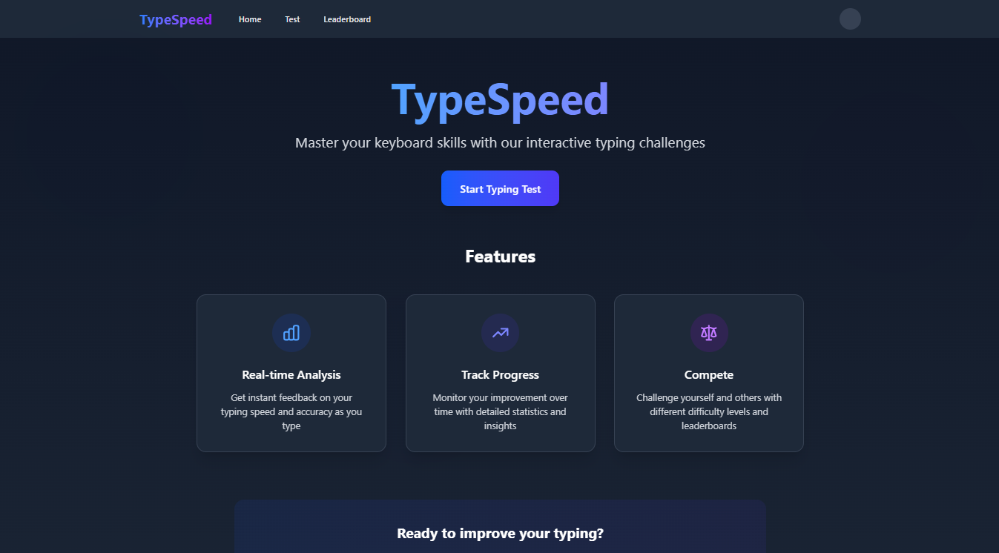
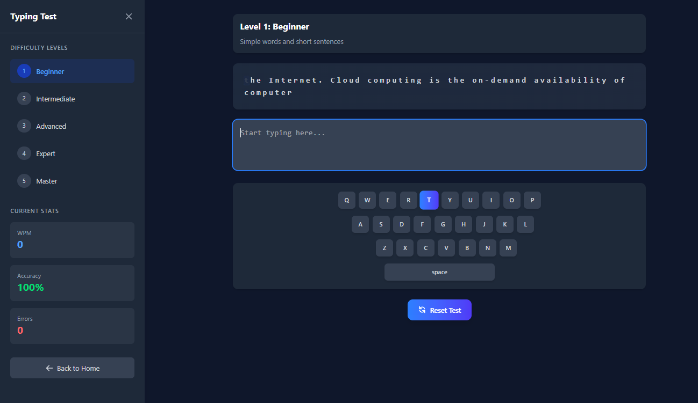

# TypeSpeed



## 🚀 Live Demo

[Try TypeSpeed Now](https://typespeed-demo.vercel.app)

## 📝 Description

TypeSpeed is a modern, interactive typing test application designed to help users improve their typing speed and accuracy. With multiple difficulty levels, real-time statistics, and a sleek user interface, TypeSpeed provides an engaging platform for users to practice and enhance their typing skills.

## ✨ Features

- **Multiple Difficulty Levels**: From beginner to master, choose the level that matches your skill
- **Real-time Statistics**: Track your WPM (Words Per Minute), accuracy, and error count as you type
- **Interactive Keyboard**: Visual feedback on which key to press next
- **Leaderboard**: Compare your performance with other users
- **Responsive Design**: Works seamlessly on desktop and mobile devices
- **Dark Mode Support**: Easy on the eyes, day or night
- **Progress Tracking**: Monitor your improvement over time

## 🛠️ Technologies Used

- **React**: Frontend library for building the user interface
- **Vite**: Next-generation frontend tooling
- **Tailwind CSS**: Utility-first CSS framework
- **Framer Motion**: Animation library for React
- **React Router**: For navigation between pages

## 🏗️ Project Structure

```
typespeed/
├── public/                 # Static assets
│   ├── favicon.ico         # Site favicon
│   └── screenshots/        # Application screenshots
├── src/                    # Source files
│   ├── components/         # Reusable UI components
│   │   ├── Header.jsx      # Navigation header
│   │   ├── Footer.jsx      # Page footer
│   │   └── Stats.jsx       # Statistics display
│   ├── pages/              # Page components
│   │   ├── Home.jsx        # Landing page
│   │   ├── TypingTest.jsx  # Main typing test
│   │   ├── Leaderboard.jsx # Leaderboard display
│   │   └── Profile.jsx     # User profile
│   ├── utils/              # Utility functions
│   │   ├── textGenerator.js # Text generation for typing tests
│   │   └── statsCalculator.js # Calculate typing statistics
│   ├── context/            # React context providers
│   │   └── ThemeContext.jsx # Dark/light mode context
│   ├── hooks/              # Custom React hooks
│   │   └── useLocalStorage.js # Local storage hook
│   ├── App.jsx             # Main application component
│   ├── main.jsx            # Entry point
│   └── index.css           # Global styles
├── .gitignore              # Git ignore file
├── index.html              # HTML template
├── package.json            # Project dependencies
├── tailwind.config.js      # Tailwind CSS configuration
├── vite.config.js          # Vite configuration
└── README.md               # Project documentation
```


## 🚀 Getting Started

### Prerequisites

- Node.js (v14.0.0 or later)
- npm or yarn

### Installation

1. Clone the repository:
   ```bash
   git clone https://github.com/AmarCodeCraft/TypeSpeed.git
   cd TypeSpeed
   ```

2. Install dependencies:
   ```bash
   npm install
   # or
   yarn
   ```

3. Start the development server:
   ```bash
   npm run dev
   # or
   yarn dev
   ```

4. Open your browser and navigate to `http://localhost:5173`

## 📱 Screenshots

### Home Page


### Typing Test


### Leaderboard


## 🤝 Contributing

Contributions are welcome! Please feel free to submit a Pull Request.

1. Fork the repository
2. Create your feature branch (`git checkout -b feature/amazing-feature`)
3. Commit your changes (`git commit -m 'Add some amazing feature'`)
4. Push to the branch (`git push origin feature/amazing-feature`)
5. Open a Pull Request

## 📄 License

This project is licensed under the MIT License - see the [LICENSE](LICENSE) file for details.

## 👨‍💻 Author

**Amar CodeCraft**
- GitHub: [AmarCodeCraft](https://github.com/AmarCodeCraft)

## 🙏 Acknowledgements

- [React Documentation](https://reactjs.org/docs/getting-started.html)
- [Tailwind CSS](https://tailwindcss.com/docs)
- [Vite](https://vitejs.dev/guide/)
- [Framer Motion](https://www.framer.com/motion/)